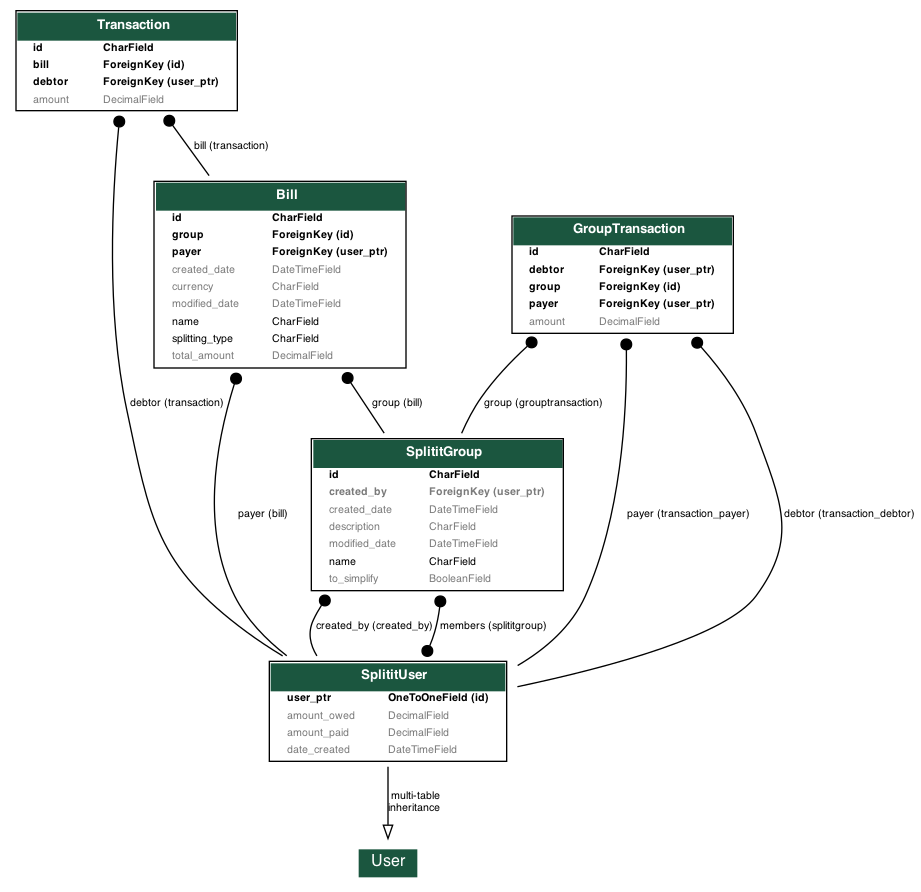

## Splitit Service

### Sections :
* [Project Goal](#project-goal-)
* [Tech Stacks](#tech-stacks-%EF%B8%8F)
* [Schema Diagram](#schema-diagram-)
* [How to run](#how-to-run-)
* [Accomplishments](#accomplishments)
* [Routes](#routes)

### Project Goal:

This is the API service layer for Splitit, which is an expense sharing application is where you can add your expenses and split it among different people. The app keeps balances between people as in who owes how much to whom.

### Tech Stack:

* This project is made with Django framework, with the standard architecture of urls, views and model, i.e. clients -> urls -> views -> models.

* Postgres is used as the database seeing to the use case which preferably requires a relational DB (due to transactional nature of the application) and also looking at the fact that Django has a great support for relational databases, postgres is a good option as it can very well scale

### Schema Diagram

For this application the schema diagram is a very core element as designing the schema perfectly here will save a lot of query cost.

### How to run

* Clone the repository

* Go to the directory and start the machines using `docker-compose up`.

* Run the Postgres migrations needed  `cd splitit && docker-compose run web python manage.py migrate`.

* Now the web application is accessible at `http://localhost:8000`

### Accomplishments ✔️:
- Database models for storing user information, their bills, transactions and groups.
- APIs for
    * register a new user
    * authenticate a user based on username and password
    * create a group
    * add a user to a group (only for group creator)
    * remove member from a group (only for group creator)
    * add a bill to the group along with details of how to split and among whom to split the bill
    * list owe amount per user in total
    * list owe amount per user in a group
    * settle balance with another user in a group
    * Edit a bill and all its details
- Option to simplify owe amount in a group between members. For example there are 3 members in a group; A, B and C. If A owes B 100, B owes C 100 and C owes A 100. Then in total no one should owe anything to anyone. (simplifying in the same group
- Automatically settle all the balances in every group between two users if their overall owe amount is zero.
- Project Dockerization

### Routes

A postman collection of all the routes have been made, one may explore it from here :-

